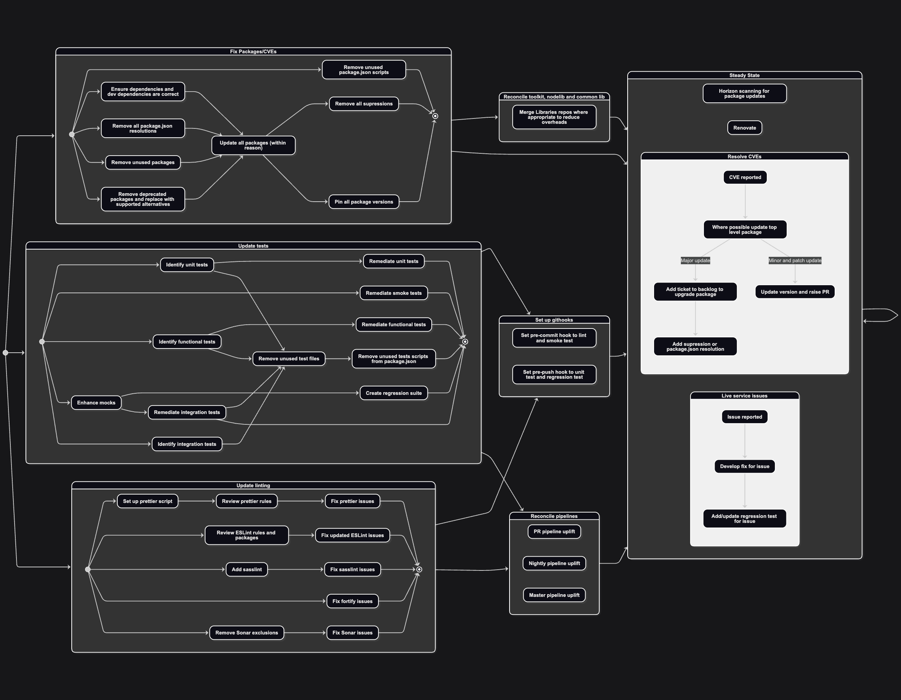

# Workflows

| Category        | Task                                         | Estimate | Notes                             |
| --------------- | -------------------------------------------- | -------- | --------------------------------- |
| CVEs            | Fix simple CVEs in all repositories          | 1 week   | In flight - EXUI-4177             |
|                 | Raise tickets for all major package upgrades | 1 day    |                                   |
|                 | Raise tickets for all deprecated packages    | 1 day    |                                   |
|                 | Upgrade each major packages                  | ?        |                                   |
|                 | Replace each deprecated package              | ?        | Low priority                      |
|                 | Ensure test packages are in dev dependencies | 1 day    |                                   |
| Automated tests | 'Migrate' integration tests to Playwright    |          | In flight with Dan and Andy       |
|                 | Remove Codecept tests                        |          |                                   |
|                 | Improve stability of E2E tests               |          | Partly in flight with Nate's work |
| Pull requests   | Auto-assign PRs for review                   |          | In flight - EXUI-4223             |
|                 | Add PR templates across repos                | 1 day    | EXUI-4222                         |
