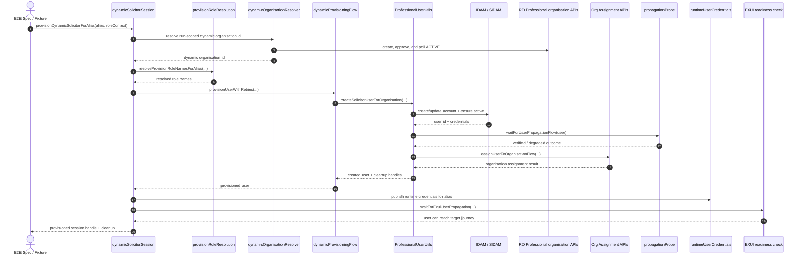
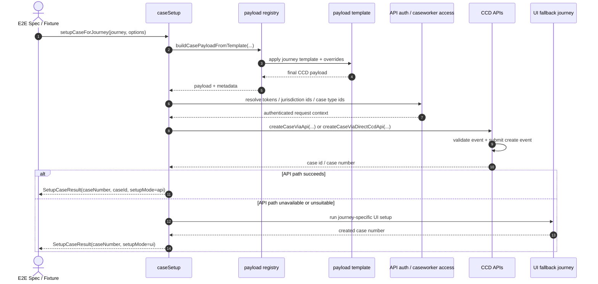

# Playwright Test Suite

This directory contains **node-api API tests**, **Playwright support unit tests**, **integration tests**, and **E2E UI tests** for the EXUI application.

## Table of Contents

- [Functional Test Overview](#functional-test-overview)
- [Quick Command Reference (AAT vs LOCAL)](#quick-command-reference-aat-vs-local)
- [Secrets and Env Population (Key Vault)](#secrets-and-env-population-key-vault)
- [Request Headers and Auth Helpers](#request-headers-and-auth-helpers)
- [Pipeline Execution and Reporting](#pipeline-execution-and-reporting)
- [Functional Test Structure and Ways of Working](#functional-test-structure-and-ways-of-working)
- [Dynamic User and API Case Setup Flows](#dynamic-user-and-api-case-setup-flows)
- [Playwright Support Unit Tests](#playwright-support-unit-tests)
- [API Tests](#api-tests)
- [E2E Tests](#e2e-tests)
- [Integration Tests](#integration-tests)
- [Session Management](#session-management)

---

## Functional Test Overview

Functional testing in this repo is the Playwright-based test set under `playwright_tests_new/`, plus the root Playwright configs and Jenkins stages that run them. The main suites are:

| Suite              | Config / project                                | Test location                                                                | Purpose                                                                                                | Main local command                                                                                   | Main CI command                                                                         |
| ------------------ | ----------------------------------------------- | ---------------------------------------------------------------------------- | ------------------------------------------------------------------------------------------------------ | ---------------------------------------------------------------------------------------------------- | --------------------------------------------------------------------------------------- |
| API functional     | `playwright.config.ts` / `node-api`             | `playwright_tests_new/api/**/*.api.ts`                                       | Node app and downstream API contracts, auth, service smoke coverage, and Playwright support unit tests | `yarn test:api:pw`                                                                                   | CNP: `yarn test:api:pw:raw`; nightly: `yarn test:api:pw:coverage:raw`                   |
| Integration UI     | `playwright.integration.config.ts` / `chromium` | `playwright_tests_new/integration/test/**/*.spec.ts`                         | Angular UI flows with mocked backend routes                                                            | `yarn test:playwright:integration`                                                                   | `yarn test:playwright:integration:raw -- --workers=<n>`                                 |
| E2E UI             | `playwright.e2e.config.ts` / `chromium`         | `playwright_tests_new/E2E/test/**/*.spec.ts`                                 | Browser journeys against live EXUI and live downstream services                                        | `yarn test:playwrightE2E`                                                                            | CNP: `yarn test:playwrightE2E:raw`; nightly cross-browser: `yarn test:crossbrowser:raw` |
| Accessibility      | `playwright.e2e.config.ts` via wrapper scripts  | `playwright_tests_new/E2E/test/**/*.a11y.spec.ts` and `@accessibility` tests | Axe/WAVE-like/Lighthouse/screen-reader-style checks                                                    | `yarn test:accessibility:playwright`                                                                 | Manual CNP when `RUN_PLAYWRIGHT_ACCESSIBILITY=true`; nightly runs by default            |
| Support unit tests | `playwright.config.ts` / `node-api`             | `playwright_tests_new/api/unit/**/*.unit.api.ts`                             | Fast fake-driven coverage for Playwright support code                                                  | `PLAYWRIGHT_SKIP_INSTALL=true yarn playwright test --project=node-api playwright_tests_new/api/unit` | Included in the API functional project unless a path/tag filter excludes them           |

Default target environment is AAT (`https://manage-case.aat.platform.hmcts.net`). Set `TEST_URL=http://localhost:3000` for local EXUI runs.

Do not use `yarn test:functional` for this Playwright suite; it is currently a compatibility placeholder that prints `Skipping functional tests`. Use the suite commands in this README instead.

### Local Prerequisites

1. Install project dependencies with `yarn install --immutable`.
2. Install browsers once, or let the wrapper scripts install them: `yarn test:setup:playwright-install-chromium` for Chromium-only runs or `yarn test:setup:playwright-install-all` for cross-browser.
3. Populate secrets into a local `.env` when you need real users or dynamic setup: `yarn env:populate:playwright:aat`.
4. Export the generated `.env` before API or config-sensitive runs: `set -a; source .env; set +a`.
5. For LOCAL UI runs, start the Node service as described in the root `README.md`, then run `yarn start:ng`, and pass `TEST_URL=http://localhost:3000`.
6. Use the F5 VPN when a run talks to private AAT/DEMO services such as RD Professional, S2S testing support, or dynamic user/organisation APIs.

E2E/session helpers load the workspace `.env` through `E2E/utils/config.utils.ts`, but the root Playwright configs and API runtime config read `process.env` directly. Sourcing `.env` before local commands is the safest consistent workflow.

---

## Quick Command Reference (AAT vs LOCAL)

By default, Playwright tests run against **AAT** from your local machine. Use `TEST_URL=http://localhost:3000` for LOCAL runs.

### Start EXUI locally (for LOCAL runs)

Follow **Startup the Node service locally** in the project root `README.md`, then run:

```bash
yarn start:ng
```

### E2E commands

```bash
# AAT: run all E2E. Produces Odhín plus a separate System Load profile by default.
yarn test:playwrightE2E

# LOCAL: run all E2E. Produces Odhín plus a separate System Load profile by default.
TEST_URL=http://localhost:3000 yarn test:playwrightE2E

# LOCAL: single spec file
TEST_URL=http://localhost:3000 yarn test:playwrightE2E -- playwright_tests_new/E2E/test/documentUpload/documentUpload.positive.spec.ts

# LOCAL: single test title inside spec
TEST_URL=http://localhost:3000 yarn test:playwrightE2E -- playwright_tests_new/E2E/test/documentUpload/documentUpload.positive.spec.ts -g "upload"

# LOCAL: headed mode
TEST_URL=http://localhost:3000 yarn test:playwrightE2E -- playwright_tests_new/E2E/test/searchCase/findCase.spec.ts --headed --workers=1

# LOCAL: debug mode
TEST_URL=http://localhost:3000 PWDEBUG=1 yarn test:playwrightE2E -- playwright_tests_new/E2E/test/myWork/myTasks.spec.ts -g "My tasks"

# LOCAL: single spec in UI mode
TEST_URL=http://localhost:3000 yarn test:playwrightE2E --ui playwright_tests_new/E2E/test/documentUpload/documentUpload.positive.spec.ts

# LOCAL: single test title in UI mode
TEST_URL=http://localhost:3000 yarn test:playwrightE2E --ui playwright_tests_new/E2E/test/searchCase/findCase.spec.ts -g "find case"

# LOCAL: single E2E by title/substring
TEST_URL=http://localhost:3000 yarn test:playwrightE2E --project=chromium --workers=1 --grep "My tasks"

# Direct E2E run without the load-profile wrapper
yarn test:playwrightE2E:raw

# Dedicated accessibility suite. Produces functional-output/tests/playwright-a11y/odhin-report/xui-playwright-a11y.html.
yarn test:a11y:playwright
```

### API commands

```bash
# AAT/LOCAL: run the Playwright support unit tests only
PLAYWRIGHT_SKIP_INSTALL=true yarn playwright test --project=node-api playwright_tests_new/api/unit

# AAT: include work-allocation tests only, disable excludes.
# Produces Odhín plus a separate System Load profile by default.
API_PW_INCLUDE_TAGS=@svc-work-allocation API_PW_EXCLUDED_TAGS_OVERRIDE=@none yarn test:api:pw

# LOCAL - produces Odhín plus a separate System Load profile by default
TEST_URL=http://localhost:3000 yarn test:api:pw

# LOCAL with coverage - produces Odhín plus a separate System Load profile by default
TEST_URL=http://localhost:3000 yarn test:api:pw:coverage

# Direct Playwright API runs without the load-profile wrapper
yarn test:api:pw:raw
yarn test:api:pw:coverage:raw
```

### Integration commands

```bash
# LOCAL integration run against a locally started application
TEST_URL=http://localhost:3000 yarn test:playwright:integration

# AAT integration run (hybrid specs retain live session authentication)
yarn test:playwright:integration

# Direct Playwright run without the load-profile wrapper
yarn test:playwright:integration:raw
```

### Odhin report locations

- API: `functional-output/tests/api_functional/odhin-report/xui-playwright-api.html`
- Integration: `functional-output/tests/playwright-integration/odhin-report/xui-playwright-integration.html`
- E2E: `functional-output/tests/playwright-e2e/odhin-report/xui-playwright-e2e.html`

Odhin dashboard notes:

- The dashboard now groups the former file summary by Playwright feature folder, for example `caseFileView`, `caseLinking`, `accessRequests`, and `hearings`.
- API, integration, and E2E reports now share the adaptive Odhin wrapper, so grouped feature summaries and inline grouped status are applied consistently across suites.
- The report stays single-page: grouped feature status is rendered directly under `Run info` instead of generating a separate drilldown page.
- Nightly failed-result trimming preserves failed steps and attachment links, disables attachment embedding in the Odhín HTML, suppresses duplicate incremental stdout/stderr hooks, and caps retained stdout and stderr at 64 KiB per stream. Jenkins also archives each failed test's `failure-data.json`, trace, and screenshots from the isolated Playwright output directories.

### Notes

- Replace `"My tasks"` with the exact test name, unique substring, or regex.
- For LOCAL runs, set `TEST_URL=http://localhost:3000`.
- If you generated `.env` from Key Vault, source it before the command when the values are needed by API tests, Playwright config, or direct `npx playwright` runs: `set -a; source .env; set +a`.

---

## Secrets and Env Population (Key Vault)

Use Key Vault tagged secrets to generate local `.env` for Playwright runs. The generated file is for local developer use and must not be committed.

- Template file: `playwright_tests_new/.env.example`
- Script wrapper: `scripts/populate-playwright-env-from-keyvault.sh`
- Underlying helper: `@hmcts/playwright-common/dist/scripts/get-secrets.js`

Tagging rule in Azure Key Vault:

- Set `tags.e2e=<ENV_VAR_NAME>` on each secret you want written into `.env`.

Supported commands:

```bash
# AAT
yarn env:populate:playwright:aat

# DEMO
yarn env:populate:playwright:demo

# Generic form (env + custom output file)
yarn env:populate:playwright aat .env

# Direct helper form (vault, template, output)
yarn get-secrets rpx-aat playwright_tests_new/.env.example .env
```

After generation, export the values into your shell for API/config-level runs:

```bash
set -a
source .env
set +a
```

CI does not read the checked-out `.env` file. Jenkins loads Azure Key Vault secrets directly into environment variables in `Jenkinsfile_CNP`, `Jenkinsfile_nightly`, and `Jenkinsfile_parameterized`.

Dynamic-user keys now available in Key Vault (`rpx-aat`, `rpx-demo`) and populated via tags:

- `ORG_USER_ASSIGNMENT_USERNAME`
- `ORG_USER_ASSIGNMENT_PASSWORD`
- `IDAM_SOLICITOR_USER_PASSWORD`
- `IDAM_CASEWORKER_DIVORCE_PASSWORD`
- `ORG_USER_ASSIGNMENT_CLIENT_ID`
- `ORG_USER_ASSIGNMENT_CLIENT_SECRET`
- `ORG_USER_ASSIGNMENT_OAUTH2_SCOPE`
- `ORG_USER_ASSIGNMENT_EXPECTED_EMAIL`
- `ORG_USER_ASSIGNMENT_REDIRECT_URI`
- `ORG_USER_ASSIGNMENT_UI_USER`
- `ORG_USER_ASSIGNMENT_USER_ROLES`
- `PW_DYNAMIC_ORGANISATION_MODE`
- `PW_DYNAMIC_ORGANISATION_RUN_ID`
- `PW_DYNAMIC_ORGANISATION_NAME_PREFIX`
- `PW_DYNAMIC_ORGANISATION_CACHE_DIR`
- `PW_DYNAMIC_ORGANISATION_ACTIVE_TIMEOUT_MS`
- `PW_DYNAMIC_ORGANISATION_ACTIVE_POLL_INTERVAL_MS`
- `MANAGE_ORG_API_PATH`
- `RD_PROFESSIONAL_API_PATH`
- `WA_SOLICITOR_USERNAME`
- `WA_SOLICITOR_PASSWORD`
- `PW_IAC_CASEOFFICER_R1_EMAIL`
- `PW_IAC_CASEOFFICER_R1_PASSWORD`
- `PW_IAC_JUDGE_WA_R1_EMAIL`
- `PW_IAC_JUDGE_WA_R1_PASSWORD`
- `PW_E2E_MANAGE_TASKS_USER`
- `PW_E2E_MANAGE_TASKS_EMAIL`
- `PW_E2E_MANAGE_TASKS_PASSWORD`

These are populated from Key Vault using the same `e2e=<ENV_VAR_NAME>` tag convention.

Notes:

- Local dynamic-user creation requires F5 VPN (AAT/DEMO private services).
- Value added: dynamic solicitor-style setup now provisions an approved organisation for the framework run, creates solicitor users inside that organisation, validates the role/readiness contract, and records setup timings. This removes the shared static-organisation capacity risk while keeping one approved organisation reused across parallel workers in the same run.
- This framework does not create live Work Allocation tasks. A previous experimental `@e2e-live-wa` lane was removed because local validation failed before the browser journey when Manage Org invite returned `403` with `{"message":"Internal Server Error"}`. Reintroduce live WA task materialisation only in a separate PR with direct AAT proof.
- `@e2e-manage-tasks` remains excluded by default because it depends on live seeded Work Allocation data. It currently covers only the live Available Tasks lane with an internal WA-capable user. Override the user with `PW_E2E_MANAGE_TASKS_USER` or with `PW_E2E_MANAGE_TASKS_EMAIL` and `PW_E2E_MANAGE_TASKS_PASSWORD` for targeted opt-in runs. Assigned My Tasks action coverage remains under `@e2e-manage-tasks-assigned` until a seeded assigned-task user or supported task materialisation flow exists.
- Dynamic solicitor-style users create or reuse one run-scoped approved organisation. The static `TEST_SOLICITOR_ORGANISATION_ID` fallback has been retired.
- `PW_DYNAMIC_ORGANISATION_MODE` is optional and only supports `dynamic`. Deprecated `static` and `auto` values fail fast so CI cannot silently fall back to a shared organisation.
- Set `PW_DYNAMIC_ORGANISATION_RUN_ID` in CI to keep parallel workers in the same framework run on one approved organisation. If it is unset, the resolver falls back to standard CI run identifiers in this order: `GITHUB_RUN_ID`, Jenkins `BUILD_TAG`, Jenkins `JOB_NAME` + `BUILD_NUMBER`, Jenkins `JOB_BASE_NAME` + `BUILD_NUMBER`, `BUILD_ID`, `BUILD_NUMBER`, Azure `BUILD_BUILDID`/`BUILD_BUILDNUMBER`, `CI_PIPELINE_ID`, then `PW_TEST_RUN_ID`. Local runs without CI markers use a process-run `local-<parent-pid>` identifier instead of the shared literal `local`; CI runs with no recognised unique identifier fail fast instead of sharing a local organisation.
- Approval uses the existing RD Professional internal approval endpoint. If RD Professional approval is unavailable, setup fails before dynamic users are created.
- Dynamic organisation resolution only reuses a cached entry when its cache key matches the current run. The cache records `approvalStrategy`, per-stage timings, `totalElapsedMs`, create/approve statuses, and poll attempts, so a run that enables this feature records the setup-time impact alongside the existing dynamic user provisioning attempts.
- Do not commit `.env`.

---

## Request Headers and Auth Helpers

Most tests should use the shared fixtures and helpers rather than building auth headers by hand.

### API Functional Headers

The `node-api` fixture in `api/fixtures.ts` creates `ApiClient` instances backed by Playwright request contexts.

- `apiClient` authenticates as the default `solicitor` role.
- `anonymousClient` sends no storage state and is used for unauthenticated checks.
- `apiClientFor(role)` creates authenticated clients for supported API roles such as `solicitor`, `waSolicitor`, `caseOfficer_r1`, and `caseOfficer_r2`.
- Every API client sets `Content-Type: application/json`.
- Every API client sets `X-Correlation-Id` to a UUID for traceability.
- Set `API_AUTO_XSRF=true` or `API_AUTH_AUTO_XSRF=true` to automatically add `X-XSRF-TOKEN` from the stored `XSRF-TOKEN` cookie for authenticated API clients.
- For action endpoints that require XSRF, prefer `withXsrf(role, async (headers) => ...)` from `api/utils/apiTestUtils.ts`; this ensures storage state exists, reads the cookie, and passes `{ 'X-XSRF-TOKEN': token }` only when present.

### API Authentication Flow

`api/utils/auth.ts` creates storage state under `.sessions/` and refreshes it when stale.

- Token bootstrap is attempted when `IDAM_SECRET`, `IDAM_WEB_URL`, `IDAM_TESTING_SUPPORT_URL`, and `S2S_URL` are available.
- Token bootstrap sends `Authorization: Bearer <idam-token>` and `ServiceAuthorization: Bearer <s2s-token>`, then touches `auth/login` and `auth/isAuthenticated` so the EXUI gateway establishes cookies.
- If token bootstrap is unavailable or fails, the helper falls back to the `/auth/login` form flow.
- Set `API_AUTH_MODE=form` or `API_USE_TOKEN_LOGIN=false` to force form login.
- Storage state files use `api-<env>-<role>.storage.json` and lock files use `api-<env>-<role>.lock`.

### Dynamic Organisation and User Setup Headers

Dynamic solicitor-style setup uses `E2E/utils/professional-user/runtime.ts`.

- `buildHeaders()` sends `Authorization: Bearer <assignment-token>`.
- It sends `ServiceAuthorization: Bearer <s2s-token>` when a service token is available.
- It sends `x-user-roles` when assignment roles are resolved.
- The headers also include `accept: application/json` and `content-type: application/json`.

---

## Pipeline Execution and Reporting

The functional pipeline behavior is defined in `Jenkinsfile_CNP`, `Jenkinsfile_nightly`, and `Jenkinsfile_parameterized`.

### CNP Pipeline

- Runs after Preview and AAT smoke stages.
- Executes API, integration, and E2E functional suites in parallel with `failFast: false` so sibling suite reports still publish if one suite fails.
- API runs `yarn test:api:pw:raw` with `FUNCTIONAL_TESTS_WORKERS=6`.
- Integration runs `yarn test:playwright:integration:raw -- --workers=<n>` through `INTEGRATION_PW_PROFILE_RUNS`; default is `workers=7`.
- E2E runs `yarn test:playwrightE2E:raw` with `FUNCTIONAL_TESTS_WORKERS=6`.
- Accessibility is manual-only on CNP and runs when `RUN_PLAYWRIGHT_ACCESSIBILITY=true`. This can be set for ad-hock runs on Jenkins, using build with parameters.
- CNP exposes tag include/exclude parameters for API, E2E, and integration, plus `PLAYWRIGHT_IGNORE_GLOBAL_EXCLUDES`.

### Nightly Pipeline

- Scheduled on `master` on weekdays by `Jenkinsfile_nightly`.
- Installs and verifies all Playwright browsers.
- Runs API, integration, cross-browser E2E, and accessibility in parallel with `failFast: false`.
- API runs `yarn test:api:pw:coverage:raw`.
- Integration uses the same profile matrix as CNP; default is `workers=7`.
- Cross-browser E2E runs `yarn test:crossbrowser:raw` with `E2E_PW_INCLUDE_TAGS=@nightly` and `E2E_PW_EXCLUDED_TAGS_OVERRIDE=@none`.
- Accessibility runs by default and is report-only unless strict mode is enabled.

### Parameterized Pipeline

- `Jenkinsfile_parameterized` mostly publishes legacy functional reports.
- The Playwright accessibility pack can be run manually with `RUN_PLAYWRIGHT_ACCESSIBILITY=true`.
- When enabled, it writes JUnit to `functional-output/tests/playwright-accessibility/playwright-accessibility-junit.xml` and publishes `functional-output/tests/playwright-accessibility/odhin-report/xui-playwright-accessibility.html`.

### Published Reports and Artifacts

| Suite               | Local/CI report file                                                                                                                                                                                                                            | Jenkins publish name examples                                                                              |
| ------------------- | ----------------------------------------------------------------------------------------------------------------------------------------------------------------------------------------------------------------------------------------------- | ---------------------------------------------------------------------------------------------------------- |
| API                 | `functional-output/tests/api_functional/odhin-report/xui-playwright-api.html`                                                                                                                                                                   | `PREVIEW API Functional Test`, `AAT API Functional Test`, `Nightly API Functional Test`                    |
| Integration         | `functional-output/tests/playwright-integration/odhin-report/<profile>/xui-playwright-integration.html` in CI profile runs; default local path is `functional-output/tests/playwright-integration/odhin-report/xui-playwright-integration.html` | `PREVIEW Playwright Integration Tests`, `AAT Playwright Integration Tests`, `Playwright Integration Tests` |
| E2E                 | `functional-output/tests/playwright-e2e/odhin-report/xui-playwright-e2e.html`                                                                                                                                                                   | `PREVIEW Playwright E2E`, `AAT Playwright E2E`, `Nightly Playwright E2E Cross Browser`                     |
| Accessibility       | `functional-output/tests/playwright-accessibility/odhin-report/xui-playwright-accessibility.html`                                                                                                                                               | `PREVIEW Playwright Accessibility`, `Nightly Playwright Accessibility Test Report`                         |
| Load profile        | `functional-output/tests/playwright-integration/load-profile/ci/load-profile.html` in CNP/nightly parent monitoring                                                                                                                             | `PREVIEW CI System Load`, `AAT CI System Load`, `Nightly CI System Load`                                   |
| Failure diagnostics | `functional-output/tests/playwright-diagnostics/failure-data/**/*` copied from `test-results/**/failure-data.json`                                                                                                                              | Archived as Jenkins artifacts                                                                              |

The wrapper commands `test:api:pw`, `test:playwrightE2E`, `test:crossbrowser`, and `test:playwright:integration` also create local System Load reports through `scripts/playwright-load-monitor.js`. Raw CI commands rely on the parent Jenkins load monitor instead.

Nightly API, integration profiles, E2E, and accessibility runs set separate `PLAYWRIGHT_OUTPUT_DIR` values. This prevents a suite starting later from cleaning another suite's redacted `failure-data.json` evidence before the diagnostics archive step runs. Raw traces and screenshots remain transient and are not copied into the retained diagnostics archive.

---

## Functional Test Structure and Ways of Working

- Keep API functional specs in `playwright_tests_new/api/` and name them `*.api.ts`.
- Keep fake-driven support tests in `playwright_tests_new/api/unit/` and name them `*.unit.api.ts`.
- Keep integration specs in `playwright_tests_new/integration/test/<feature>/` with `.positive.spec.ts` and `.negative.spec.ts` naming where the feature has both success and error-path coverage.
- Keep integration mock builders and route helpers under `integration/mocks/` and `integration/helpers/`.
- Keep E2E specs in `playwright_tests_new/E2E/test/<feature>/`.
- Keep E2E page objects under `E2E/page-objects/pages/exui/`; avoid hiding test data creation inside page objects.
- Prefer role/session helpers (`ensureSession`, `apiClient`, `apiClientFor`, `withXsrf`, dynamic-user fixtures) over inline login or inline request-auth setup.
- Tag tests with the suite tag plus a feature tag, for example `@e2e @e2e-search-case`, `@integration @integration-search-case`, or `@svc-work-allocation`.
- Use the `*_PW_INCLUDE_TAGS` and `*_PW_EXCLUDED_TAGS_OVERRIDE` env vars for repeatable filtering; use `@none` to clear repo defaults for one run.
- Prefer `data-testid` selectors and Playwright CSS classes.
- Use `@hmcts/playwright-common` table utilities for table assertions.
- Do not commit `.env`, `.sessions/`, `test-results/`, or generated `functional-output/` reports.
- When triaging failures, check Odhín first, then attached API logs or `failure-data.json`, then session/dynamic-user provisioning evidence before changing retries or worker counts.

---

## Dynamic User and API Case Setup Flows

These diagrams show the two main setup paths that confuse new testers most often:

- dynamic user creation for solicitor-style E2E journeys
- API-driven case generation before an E2E or integration flow starts

### Dynamic User Creation



### API Case Generation



### Reading the Diagrams

- Dynamic-user provisioning starts in `dynamicSolicitorSession.ts` and delegates most heavy lifting into `dynamicProvisioningFlow.ts`, `professional-user.utils.ts`, and the extracted `professional-user/` collaborators.
- API case setup starts in `caseSetup.ts` and uses `payloads/registry.ts` plus the journey templates under `E2E/utils/test-setup/payloads/templates/`.
- The returned case number or runtime user credentials are then consumed by the spec or fixture layer, not hidden inside the page objects.
- Provisioning failures should be triaged from the recorded attempt diagnostics before changing retry policy. The terminal `DynamicProvisioningError` includes every attempt, duration, retryability decision, and last error, and the fixture attaches the same attempt history to the test evidence.

---

## Playwright Support Unit Tests

Unit-style tests for Playwright support code live under `playwright_tests_new/api/unit/` and run on the existing `node-api` project. Use this layer for pure helpers, policy resolution, and fake-driven orchestration that does not need a real browser journey.

Examples include:

- `playwright_tests_new/api/unit/create-case.flow.unit.api.ts`
- `playwright_tests_new/api/unit/data-loss-scenarios.unit.api.ts`
- `playwright_tests_new/api/unit/dynamic-solicitor-session.unit.api.ts`
- `playwright_tests_new/api/unit/dynamic-user.pure.unit.api.ts`
- `playwright_tests_new/api/unit/dynamic-user.orchestration.unit.api.ts`
- `playwright_tests_new/api/unit/dynamic-user.runtime.unit.api.ts`

### Running Unit Tests

```bash
# Run all Playwright support unit tests
PLAYWRIGHT_SKIP_INSTALL=true yarn playwright test --project=node-api playwright_tests_new/api/unit

# Run one unit-test file
PLAYWRIGHT_SKIP_INSTALL=true yarn playwright test --project=node-api playwright_tests_new/api/unit/dynamic-user.pure.unit.api.ts

# Run one unit test by title
PLAYWRIGHT_SKIP_INSTALL=true yarn playwright test --project=node-api playwright_tests_new/api/unit -g "resolveSolicitorRoleStrategy"
```

### Data Loss Scenario Coverage

The historical data-loss coverage map for `EXUI-848`, `EXUI-811`, `EXUI-433`, `EXUI-942`, and `EXUI-702` lives in `E2E/utils/test-setup/dataLossScenarioMatrix.ts`.

- `EXUI-848`, `EXUI-811`, `EXUI-433`, and `EXUI-942` are covered by the tagged create-case E2E journey `@e2e-data-loss`, which creates a fresh Divorce PoC case and asserts the Data and History tab values after submit.
- `EXUI-702` is deliberately marked as follow-up until the NoC owning mock contract is agreed, because closing that path needs an API-required NoC route-backed scenario rather than a looser UI-only assertion.
- `playwright_tests_new/api/unit/data-loss-scenarios.unit.api.ts` fails if any historical ticket loses its case type, setup route, protected tabs, protected fields, or assertion layer mapping.

### Placement Rules

- Keep unit tests for `playwright_tests_new` support code inside `playwright_tests_new/`.
- Prefer `playwright_tests_new/api/unit/` for fake-driven tests that exercise Playwright support modules without a browser journey.
- Do not add separate runners or support harnesses under `api/test/` for this layer unless there is an exceptional documented reason.

---

## API Tests

API tests are located in `playwright_tests_new/api/` and run on the Playwright `node-api` project. The root `yarn test:api` script is a compatibility command that also runs this project.

### Prerequisites

- Node 20+, Yarn installed
- Environment variables:
  - `TEST_URL` (e.g. `https://manage-case.aat.platform.hmcts.net/`)
  - `TEST_ENV` (`aat`/`demo`)
  - IDAM/S2S endpoints used by `@hmcts/playwright-common`: `IDAM_WEB_URL`, `IDAM_TESTING_SUPPORT_URL`, `S2S_URL`, optional `S2S_SECRET`
- User credentials are resolved from `api/utils/apiTestRuntimeConfig.ts` for the selected `TEST_ENV`
- Source the generated `.env` before local API runs when credentials or IDAM/S2S values are needed.

### Running API Tests

```bash
# Run only Playwright support unit tests
PLAYWRIGHT_SKIP_INSTALL=true yarn playwright test --project=node-api playwright_tests_new/api/unit

# Smoke the API suite
yarn test:api:pw

# Capture raw V8 coverage + Playwright attachments
yarn test:api:pw:coverage
```

### API Service Tag Filtering

- API suites are tagged per downstream service using Playwright tags (for example `@svc-ccd`, `@svc-work-allocation`).
- Default excluded tags are read from `playwright_tests_new/api/service-tag-filter.json` (`excludedTags` array).
- Override excludes at runtime with `API_PW_EXCLUDED_TAGS_OVERRIDE`.
- Optionally run only selected service tags with `API_PW_INCLUDE_TAGS`.
- Tag inputs accept comma or space separated values, with or without `@`.
- Set `API_PW_EXCLUDED_TAGS_OVERRIDE=@none` to clear repo defaults for one run.
- Jenkins exposes these as string parameters with the same names.
- Key Vault-backed global exclusions are additive through `PLAYWRIGHT_GLOBAL_EXCLUDED_TAGS`; see [`docs/playwright-global-exclusions.md`](../docs/playwright-global-exclusions.md).

```bash
# Exclude one service for this run (overrides file excludes)
API_PW_EXCLUDED_TAGS_OVERRIDE=@svc-ccd yarn test:api:pw

# Run only work allocation API tests
API_PW_INCLUDE_TAGS=@svc-work-allocation yarn test:api:pw:coverage

# Ignore file-level excludes for this run
API_PW_EXCLUDED_TAGS_OVERRIDE=@none yarn test:api:pw
```

### API Test Parallelism

- API, E2E, and local integration defaults are controlled by each Playwright config unless `FUNCTIONAL_TESTS_WORKERS` is set
- Jenkins pins `FUNCTIONAL_TESTS_WORKERS=6` for API, E2E, and cross-browser E2E, and CNP/nightly integration profiles default to 7 workers
- The worker defaults keep the XUI 8CPU Jenkins agent below full per-suite saturation while leaving integration as the longest lane; monitor preview/AAT backend behaviour through the published Odhín and CI System Load reports
- Jenkins runs API, integration, and E2E in parallel report-gathering mode: a failed suite fails its branch, but sibling suites continue so their Odhín and load reports are still published
- Locally, the same suite defaults apply; override with `FUNCTIONAL_TESTS_WORKERS` or the Playwright `--workers` flag

### Playwright Load Profiling

The standard API, E2E, cross-browser E2E, and integration commands run through the load-profile wrapper by default. The wrapper samples the local/Jenkins host while the run is executing and writes a standalone **System Load** profile. Jenkins publishes that profile as a separate HTML report instead of adding it to Odhín.

```bash
# Run integration with a host-load profile and explicit workers
yarn test:playwright:integration -- --workers=7

# Backwards-compatible alias
yarn test:playwright:integration:profile -- --workers=7
```

Artifacts:

- API Odhín report: `functional-output/tests/api_functional/odhin-report/xui-playwright-api.html`
- E2E Odhín report: `functional-output/tests/playwright-e2e/odhin-report/xui-playwright-e2e.html`
- Integration Odhín report: `functional-output/tests/playwright-integration/odhin-report/xui-playwright-integration.html`
- API standalone chart: `functional-output/tests/api_functional/odhin-report/load-profile/load-profile.html`
- E2E standalone chart: `functional-output/tests/playwright-e2e/odhin-report/load-profile/load-profile.html`
- Integration standalone chart when using the default local wrapper: `functional-output/tests/playwright-load-profile/load-profile.html`
- Integration raw samples when using the default local wrapper: `functional-output/tests/playwright-load-profile/samples.json`
- Integration summary when using the default local wrapper: `functional-output/tests/playwright-load-profile/summary.json`
- Jenkins parent CI load profile: `functional-output/tests/playwright-integration/load-profile/ci/load-profile.html`

Useful controls:

- `PW_LOAD_PROFILE_INTERVAL_MS=1000` changes the sample interval
- `PW_LOAD_PROFILE_OUTPUT=<path>` changes the artifact folder
- `PW_LOAD_PROFILE_EVENTS_FILE=<jsonl-or-json>` overlays external start/finish markers on the load chart

Jenkins CNP and nightly integration stages use `INTEGRATION_PW_PROFILE_RUNS` to control the integration worker profile. The default is:

```text
workers=7
```

Use `INTEGRATION_PW_WORKERS=<n>` on Jenkins to run a targeted integration profile instead of the default `INTEGRATION_PW_PROFILE_RUNS` value. CNP and nightly publish one **CI System Load** HTML report for the Jenkins run after checkout. They write checkout, install, build, browser install, report publishing, API, E2E, and integration stage markers to the profile event file so the report can show which stage was running when CPU, load, or memory changed. Functional suite fan-out is parallel with `failFast=false` so one failed suite does not prevent the remaining suite reports from being collected. Jenkins defaults do not shard integration because split shard reports make diagnosis harder.

The wrapper always marks the wrapped command start and finish on the chart. To show API, E2E, and integration boundaries on one timeline, run a monitor across the parent pipeline window or write shared JSONL events into `PW_LOAD_PROFILE_EVENTS_FILE`:

```json
{"label":"API","type":"start","timestamp":"2026-04-30T09:00:00.000Z"}
{"label":"API","type":"finish","timestamp":"2026-04-30T09:06:30.000Z"}
{"label":"E2E","type":"start","timestamp":"2026-04-30T09:00:20.000Z"}
{"label":"E2E","type":"finish","timestamp":"2026-04-30T09:18:10.000Z"}
{"label":"Integration","type":"start","timestamp":"2026-04-30T09:01:00.000Z"}
{"label":"Integration","type":"finish","timestamp":"2026-04-30T09:13:45.000Z"}
```

Treat the profile as capacity evidence. If failures appear while CPU, load/core, or memory are saturated, reduce workers or shard. If load is healthy, investigate the test/app contract instead of masking the failure with more retries.

### API Authentication Model

- **Default behavior**: `utils/auth.ts` attempts token/S2S login using `IdamUtils.generateIdamToken` (password grant) plus `ServiceAuthUtils.retrieveToken`
- **Fallback**: If token bootstrap fails or env vars are absent, falls back to `/auth/login` form flow and caches storage state under `.sessions/api-<env>-<role>.storage.json`
- **Required for token bootstrap**: `IDAM_WEB_URL`, `IDAM_TESTING_SUPPORT_URL`, `IDAM_SECRET`, and `S2S_URL`; `IDAM_CLIENT_ID`/`SERVICES_IDAM_CLIENT_ID` defaults to `xuiwebapp`, and `S2S_MICROSERVICE_NAME`/`MICROSERVICE` defaults to `xui_webapp`
- **XSRF handling**: Set `API_AUTO_XSRF=true` to auto-inject the `X-XSRF-TOKEN` header from stored cookies
- **Correlation IDs**: Every API client request context sets `X-Correlation-Id` to a UUID for traceability

### API Reports

- Primary Odhín report generated by the raw API command: `functional-output/tests/playwright-api/odhin-report/xui-playwright-api.html`
- Copied to `functional-output/tests/api_functional/odhin-report/xui-playwright-api.html` for Jenkins publishing and local wrapper consistency
- API call logs attached automatically per test as `node-api-calls.json`

### API Coverage

- `test:api:pw:coverage` wraps Playwright run in `c8` to collect V8 coverage for test code (not the Node API service)
- Server-side Node coverage stays in Mocha + c8 (`yarn coverage:node`)
- Coverage output: `./reports/tests/coverage/api-playwright`

### What API Tests Cover

- **Playwright support unit tests**: Fake-driven coverage for support modules under `playwright_tests_new/api/unit/`
- **Unauthenticated routes**: Assert 401 + `{ message: 'Unauthorized' }` body
- **Node shell**: Verify auth status, user details payload, feature flags
- **CCD/case-share**: Check jurisdictions, work-basket inputs, profiles, organizations
- **Postcode lookup**: Assert result/header structure and DPA fields
- **Work Allocation**: Locations, catalogues, task search, dashboards, negative actions, caseworker endpoints
- **Global search/ref-data**: Services, results, proxy smoke, WA/staff supported jurisdictions, role-access/AM checks

---

## E2E Tests

E2E UI tests are located in `playwright_tests_new/E2E/` and test the full user interface workflows.

### Running E2E Tests

```bash
# Run all E2E tests
yarn test:playwrightE2E

# Run specific test file
npx playwright test --config=playwright.e2e.config.ts playwright_tests_new/E2E/test/documentUpload/documentUpload.positive.spec.ts --project chromium

# Run with single worker (local development)
npx playwright test --config=playwright.e2e.config.ts --project chromium --workers=1

# Clean sessions and re-run
rm -rf .sessions && npx playwright test --config=playwright.e2e.config.ts
```

### E2E Tag Filtering

- E2E suites are tagged with `@e2e` plus feature tags such as `@e2e-search-case` and `@e2e-manage-tasks`.
- `@e2e-manage-tasks` is excluded by default because the live WA lane depends on seeded task data. Use `E2E_PW_EXCLUDED_TAGS_OVERRIDE=@none E2E_PW_INCLUDE_TAGS=@e2e-manage-tasks` only for targeted opt-in runs with a configured WA user and known data.
- Accessibility specs use `@a11y` and are excluded from default E2E unless `PLAYWRIGHT_INCLUDE_A11Y=true` or `yarn test:a11y:playwright` is used.
- Accessibility runs default to 6 workers; override with `PW_A11Y_WORKERS` when a lower local worker count is needed.
- Default excluded tags are read from `playwright_tests_new/E2E/tag-filter.json` (`excludedTags` array).
- Override excludes at runtime with `E2E_PW_EXCLUDED_TAGS_OVERRIDE`.
- Optionally run only selected E2E tags with `E2E_PW_INCLUDE_TAGS`.
- Tag inputs accept comma or space separated values, with or without `@`.
- Set `E2E_PW_EXCLUDED_TAGS_OVERRIDE=@none` to clear repo defaults for one run.
- Jenkins exposes these as string parameters with the same names.
- Key Vault-backed global exclusions are additive through `PLAYWRIGHT_GLOBAL_EXCLUDED_TAGS`; see [`docs/playwright-global-exclusions.md`](../docs/playwright-global-exclusions.md).
- The Civil data-loss regression is tagged `@e2e-civil-data-loss`, `@e2e-data-loss`, and `@nightly`, so it is excluded from the default PR E2E set. Run it explicitly when validating the Civil Create Case Flag data-loss path:

```bash
E2E_PW_INCLUDE_TAGS=@e2e-civil-data-loss \
E2E_PW_EXCLUDED_TAGS_OVERRIDE=@none \
yarn test:playwrightE2E:raw
```

```bash
# Run only search-case E2E tests
E2E_PW_INCLUDE_TAGS=@e2e-search-case yarn test:playwrightE2E

# Re-enable the V1 document-upload test for a targeted run
E2E_PW_EXCLUDED_TAGS_OVERRIDE=@none E2E_PW_INCLUDE_TAGS=@e2e-document-upload-v1 yarn test:playwrightE2E

# Ignore file-level excludes for this run
E2E_PW_EXCLUDED_TAGS_OVERRIDE=@none yarn test:playwrightE2E
```

---

## Integration Tests

Integration tests are located in `playwright_tests_new/integration/` and test Angular application integration with mocked backend APIs.

File naming convention:

- Use `<feature>.positive.spec.ts` for happy-path and expected-success coverage.
- Use `<feature>.negative.spec.ts` for validation, access-control, backend-failure, and resilience/error-path coverage.
- If a feature needs both, split the scenarios across two files rather than mixing them in one spec.

### Running Integration Tests

```bash
# Run all integration tests
yarn test:playwright:integration

# Run specific integration test file
npx playwright test --config=playwright.integration.config.ts playwright_tests_new/integration/test/caseList/caseList.positive.spec.ts

# Run the main integration project
npx playwright test --config=playwright.integration.config.ts --project=chromium

# Run only search-case integration tests via tags
INTEGRATION_PW_INCLUDE_TAGS=@integration-search-case npx playwright test --config=playwright.integration.config.ts --project=chromium

# Disable Odhin locally when you want the fastest possible run
PW_INTEGRATION_ODHIN=0 INTEGRATION_PW_INCLUDE_TAGS=@integration-search-case npx playwright test --config=playwright.integration.config.ts --project=chromium
```

### Integration Tag Filtering

- Integration suites are tagged with `@integration` plus feature tags such as `@integration-search-case` and `@integration-manage-tasks`.
- Default excluded tags are read from `playwright_tests_new/integration/tag-filter.json` (`excludedTags` array).
- Override excludes at runtime with `INTEGRATION_PW_EXCLUDED_TAGS_OVERRIDE`.
- Optionally run only selected integration tags with `INTEGRATION_PW_INCLUDE_TAGS`.
- Tag inputs accept comma or space separated values, with or without `@`.
- Set `INTEGRATION_PW_EXCLUDED_TAGS_OVERRIDE=@none` to clear repo defaults for one run.
- Jenkins exposes these as string parameters with the same names.
- Key Vault-backed global exclusions are additive through `PLAYWRIGHT_GLOBAL_EXCLUDED_TAGS`; see [`docs/playwright-global-exclusions.md`](../docs/playwright-global-exclusions.md).

```bash
# Run only search-case integration tests
INTEGRATION_PW_INCLUDE_TAGS=@integration-search-case yarn test:playwright:integration

# Temporarily switch off manage-tasks integration tests
INTEGRATION_PW_EXCLUDED_TAGS_OVERRIDE=@integration-manage-tasks yarn test:playwright:integration

# Ignore file-level excludes for this run
INTEGRATION_PW_EXCLUDED_TAGS_OVERRIDE=@none yarn test:playwright:integration
```

Notes:

- Search-case integration specs now run in the main `chromium` project and can be isolated with `INTEGRATION_PW_INCLUDE_TAGS=@integration-search-case`
- Integration session warmup is opt-in through `PW_INTEGRATION_SESSION_WARMUP_USERS`; use a comma-separated user list for targeted pre-capture, `@default` for the legacy shared pool, or `@none` to force no warmup
- Integration specs continue to run on the default 7-worker `chromium` project unless `FUNCTIONAL_TESTS_WORKERS` is pinned explicitly
- Odhin remains enabled by default for integration runs, including local runs
- Local integration Odhin uses a lightweight profile by default and emits explicit finalization timing so post-test report generation is visible and bounded
- Local integration Odhin also bounds runtime reporter hooks by default; override with `PW_ODHIN_RUNTIME_HOOK_TIMEOUT_MS=<ms>` or set `0` to disable the local safeguard
- Local integration Odhin disables browser console capture by default; opt in with `PW_ODHIN_CONSOLE_LOG=1 PW_ODHIN_CONSOLE_ERROR=1`
- Odhin finalization progress is suppressed for quick completions and only starts printing after the grace window set by `PW_ODHIN_PROGRESS_GRACE_MS`

### Integration Test Structure

- **Tests**: `integration/test/` - Test specifications organized by feature
- **Mocks**: `integration/mocks/` - Mock response builders for API routes
- **Configuration**: Frontend mocking uses Playwright's route interception to mock backend API responses

### Mock Management

Integration tests use route interception with mock builders:

```ts
import { buildCaseListMock } from '../../mocks/caseList.mock';

// Mock API response
await page.route('**/api/cases**', async (route) => {
  await route.fulfill({
    status: 200,
    body: JSON.stringify(buildCaseListMock(124)),
  });
});
```

---

### E2E Test Structure

- **Page Objects**: `E2E/page-objects/pages/exui/` - Reusable page interaction methods
- **Utilities**: `E2E/utils/` - Table parsing, user management, configuration
- **Tests**: `E2E/test/` - Test specifications organized by feature
- **Fixtures**: `E2E/fixtures.ts` - Custom Playwright fixtures
- **Welsh Language**: Welsh language coverage now lives in `playwright_tests_new/integration/test/welshLanguage/` (removed from E2E)

### Table Parsing (Playwright Common)

Use the table parser from `@hmcts/playwright-common` for **all** tables. This avoids brittle locators and standardizes table handling across tests.

Rules:

- Prefer `tableUtils.parseDataTable()` for normal tables with headers.
- Use `tableUtils.parseWorkAllocationTable()` for WA task tables.
- Do not assert `table.length === 0` for empty tables. Empty state rows are returned as a single row.

Example:

```ts
// Case flags table
await caseDetailsPage.selectCaseDetailsTab('Flags');
const table = await tableUtils.parseDataTable(await caseDetailsPage.getTableByName('Case level flags'));
const visibleRows = table.filter((row) => Object.values(row).join(' ').trim() !== '');
expect(visibleRows.length).toBeGreaterThan(0);
```

---

## Session Management

### Overview

**E2E, hybrid integration, and API tests** use lazy storage-state capture under the shared `.sessions/` directory. The files are namespaced by suite style so parallel workers can reuse the right state without colliding.

Integration session warmup is best-effort: if warmup fails, route-mocked specs can still run and hybrid specs capture their required live sessions lazily. Specs may use `applyMockSessionCookies` only when their application-shell and feature API routes are self-contained. The helper registers `**/auth/isAuthenticated*`, adds a deterministic `__userid__` cookie without creating a plausible live auth token, and returns a guard that must be checked after each test. The guard blocks and reports any same-origin XHR or fetch request that was not fulfilled by a feature or application-shell mock. Other integration specs continue to use `applySessionCookies` and the storage-backed IDAM flow below.

### Unified Storage Location

```
.sessions/
├── xui_auto_test_user_solicitor@mailinator.com.storage.json   # E2E browser session
├── api-aat-solicitor.storage.json                              # API session (same user)
├── employment_service@mailinator.com.storage.json              # E2E browser session
├── api-aat-caseOfficer_r1.storage.json                         # API session
└── *.lock                                                       # Coordination lock files
```

**Why shared storage matters:**

- API and E2E tests often use the same underlying user credentials, but they need different storage-state files.
- With one directory and clear prefixes, stale files and lock files are easy to inspect during triage:
  - E2E sessions: `{email}.storage.json`
  - API sessions: `api-{env}-{role}.storage.json`
- Lock files coordinate workers that request the same E2E session key or the same API role.
- API and E2E do not share a single lock file and do not reuse one another's storage-state file.

### How It Works

#### 1. Lazy Loading

- Sessions are **NOT** pre-captured during global setup
- Each test specifies which user it needs via `ensureSession()` (E2E) or fixtures (API)
- Sessions are captured only when first requested
- Cached sessions are reused across tests and workers

#### 2. Session Freshness

- E2E `sessionCapture` storage defaults to **60 minutes** and can be overridden with `PW_SESSION_MAX_AGE_MS`.
- E2E UI storage helpers under `E2E/utils/session-storage.utils.ts` default to **15 minutes** and can be overridden with `PW_UI_STORAGE_TTL_MIN`.
- API storage defaults to **15 minutes** in `api/utils/auth.ts`.
- Stale storage is automatically refreshed; fresh storage is reused by later tests and workers in the same namespace.

#### 3. CI Parallel Execution (Configurable Workers per Test Suite)

- Multiple workers can safely request the same user session
- **Filesystem-based lock mechanism** prevents concurrent logins for the same user
- Locks are implemented with `proper-lockfile`
- Jenkins currently runs API and E2E with **6 workers** and integration with **7 workers** on both Preview and AAT
- When one worker logs in user X for the same E2E session key, the remaining E2E/integration workers wait for lock release and reuse that E2E storage state
- When one API worker creates `api-<env>-<role>.storage.json`, other API workers for that role wait for lock release and reuse that API storage state
- After acquiring lock, workers recheck freshness to ensure session is still valid
- `ensureSession()` intentionally avoids forced recapture so lock waiters can reuse the newly refreshed session instead of logging in again
- Integration features can be targeted independently with `INTEGRATION_PW_INCLUDE_TAGS`

### Usage in E2E Tests

```typescript
import { ensureSession, loadSessionCookies } from '../../../common/sessionCapture';

test.describe('My Test Suite', () => {
  test.beforeAll(async () => {
    // Lazy capture: only log in when this test suite runs
    await ensureSession('SOLICITOR');
  });

  test.beforeEach(async ({ page }) => {
    // Load cached session cookies
    const { cookies } = loadSessionCookies('SOLICITOR');
    if (cookies.length) {
      await page.context().addCookies(cookies);
    }
    await page.goto('/');
  });

  test('should do something', async ({ page }) => {
    // Test implementation
  });
});
```

### Available User Identifiers

- `SOLICITOR` - Standard solicitor user for Private Law / civil cases
- `DIVORCE_SOLICITOR` - Divorce-entitled solicitor user for divorce create/update journeys
- `WA_SOLICITOR` - Legacy solicitor-style user. Do not use it for live Work Allocation task-list E2E; local AAT evidence showed it authenticates without `roleAssignmentInfo` and lands on Case list.
- `IAC_CASEOFFICER_R1` - Internal Work Allocation-capable user for live Available Tasks E2E when `PW_IAC_CASEOFFICER_R1_EMAIL` and `PW_IAC_CASEOFFICER_R1_PASSWORD` are populated.
- `SEARCH_EMPLOYMENT_CASE` - Employment tribunal case user
- `STAFF_ADMIN` - Administrative staff user
- `USER_WITH_FLAGS` - User with case flags enabled

### File Naming Convention

| Test Type      | User Role      | File Pattern                    | Example                                                    |
| -------------- | -------------- | ------------------------------- | ---------------------------------------------------------- |
| **E2E**        | Any            | `{email}.storage.json`          | `xui_auto_test_user_solicitor@mailinator.com.storage.json` |
| **API**        | solicitor      | `api-{env}-{role}.storage.json` | `api-aat-solicitor.storage.json`                           |
| **API**        | caseOfficer_r1 | `api-{env}-{role}.storage.json` | `api-aat-caseOfficer_r1.storage.json`                      |
| **Lock files** | Any            | `{filename}.lock`               | `xui_auto_test_user_solicitor@mailinator.com.lock`         |

### Parallel Suite Storage in CI

When API, E2E, and integration suites run in parallel, they write into the same `.sessions/` directory but use different filenames:

```
.sessions/
  xui_auto_test_user_solicitor@mailinator.com.storage.json
  xui_auto_test_user_solicitor@mailinator.com.lock
  api-aat-solicitor.storage.json
  api-aat-solicitor.lock
```

This gives two useful properties:

- Workers inside the same suite/role avoid duplicate logins by waiting on the matching lock.
- API and E2E storage states stay separate, so an API request context cannot accidentally consume a browser session file and vice versa.

Do not assume that an API run will reuse an E2E login. It creates or refreshes its own `api-<env>-<role>.storage.json`.

### Example Scenarios

#### Single Worker (Local Development)

```bash
npx playwright test --config=playwright.e2e.config.ts playwright_tests_new/E2E/test/documentUpload/documentUpload.positive.spec.ts --project=chromium --workers=1
```

- Logs in SOLICITOR once (~30s)
- Logs in SEARCH_EMPLOYMENT_CASE once (~30s)
- Total login time: ~60s

#### 6 Workers (Parallel Jenkins API/E2E Suites)

```bash
npx playwright test --config=playwright.e2e.config.ts --project=chromium --workers=6
```

- Worker 1 logs in SOLICITOR → stores session
- Workers 2-6 wait for lock → reuse SOLICITOR session
- Total login time per user: ~30-45s (shared across all workers)

#### 7 Workers (Integration Jenkins Suite)

```bash
npx playwright test --config=playwright.integration.config.ts --project=chromium --workers=7
```

- Worker 1 logs in SOLICITOR → stores session
- Workers 2-7 wait for lock → reuse SOLICITOR session
- Total login time per user: ~30-45s (shared across all workers)

#### Auto-Sized Workers (Local or Unpinned CI)

```bash
npx playwright test --config=playwright.e2e.config.ts --project=chromium
```

- One worker logs in SOLICITOR and stores the session
- Other workers wait for lock release and reuse the fresh session
- Total login time per user remains shared across all workers

#### Parallel Test Suites (CI Pipeline)

```bash
# Running simultaneously:
npx playwright test --config=playwright.e2e.config.ts --project=chromium --workers=6  # Preview E2E tests
npx playwright test --project=node-api --workers=6  # Preview API tests
npx playwright test --config=playwright.integration.config.ts --project=chromium --workers=7  # Preview integration tests

# AAT:
npx playwright test --config=playwright.e2e.config.ts --project=chromium --workers=6  # AAT E2E tests
npx playwright test --project=node-api --workers=6  # AAT API tests
npx playwright test --config=playwright.integration.config.ts --project=chromium --workers=7  # AAT integration tests

# Local or unpinned CI:
npx playwright test --config=playwright.e2e.config.ts --project=chromium  # E2E tests
npx playwright test --project=node-api  # API tests
```

- E2E workers share the E2E storage state for the same session key.
- API workers share the API storage state for the same role.
- Integration workers share E2E-style storage state when they use the same session helper and session key.
- The suites stay namespaced even when they use the same underlying user credentials.

### Session Storage

Sessions are stored in `.sessions/` directory with filesystem-based locking:

```
.sessions/
  ├── xui_auto_test_user_solicitor@mailinator.com.storage.json    # E2E session
  ├── xui_auto_test_user_solicitor@mailinator.com.lock            # E2E lock file
  ├── api-aat-solicitor.storage.json                              # API session (same user!)
  ├── api-aat-solicitor.lock                                       # API lock file
  ├── employment_service@mailinator.com.storage.json              # E2E session
  ├── employment_service@mailinator.com.lock                       # E2E lock file
  ├── api-aat-caseOfficer_r1.storage.json                         # API session
  └── api-aat-caseOfficer_r1.lock                                  # API lock file
```

**Lock file behavior:**

- Created when a worker/test suite attempts to log in
- Held during login process (2-5 seconds)
- Released in `finally` block to prevent deadlocks
- Other workers poll for up to 90 seconds while checking whether another worker has already refreshed the target session
- After lock released, waiting workers recheck session freshness
- Waiting workers can skip lock acquisition entirely if the target session becomes fresh while they are polling
- Waiting workers skip login if session became fresh while waiting (prevents duplicate recapture storms)
- Stale threshold: 60 seconds (if lock held longer, considered abandoned)

### Implementation Details

#### E2E Session Capture ([common/sessionCapture.ts](common/sessionCapture.ts))

```typescript
// Filesystem lock coordinates across all workers
const lockFilePath = path.join(sessionsDir, `${email}.lock`);
const release = await lockfile.lock(lockFilePath, {
  retries: { retries: 30, minTimeout: 1000, maxTimeout: 5000 },
  stale: 60000,
});

try {
  // Recheck freshness after acquiring lock
  if (isSessionFresh(sessionPath)) {
    logger.info('Another worker logged in, reusing session');
    return;
  }

  // Login and save session
  await browser.newContext().storageState({ path: sessionPath });
} finally {
  await release(); // Always release lock
}
```

#### API Session Capture ([api/utils/auth.ts](api/utils/auth.ts))

```typescript
// Same approach: filesystem lock + freshness check
const lockFilePath = path.join(storageRoot, `api-${cacheKey}.lock`);
const release = await lockfile.lock(lockFilePath, {
  /* same config */
});

try {
  // Double-check freshness (E2E may have logged in this user)
  if (isStorageStateFresh(storagePath)) {
    return storagePath; // Reuse existing session
  }

  // Create new session via token bootstrap or form login
  await createStorageState(role);
} finally {
  await release();
}
```

### Troubleshooting

#### Dynamic Provisioning Failures

When a run fails before the browser journey starts, check the setup evidence first:

1. Open the Playwright failure attachment named `<alias>-dynamic-user-provision-attempts.json`.
2. In the Playwright HTML/Odhín artifacts, open the `failure-data.json` attachment for the failed test.
3. Read the terminal `DynamicProvisioningError` attempt diagnostics. It should show each provisioning attempt, whether it was retryable, and the final downstream error.
4. Keep the default retry policy unless the failure evidence proves that the retry budget itself is the problem.

#### Session Expired During Test

If tests fail with authentication errors:

1. Delete the `.sessions/` directory
2. Re-run tests to capture fresh sessions

```bash
rm -rf .sessions && npx playwright test --config=playwright.e2e.config.ts
```

#### Concurrent Login Issues

If multiple workers attempt to login simultaneously:

- The lock mechanism should handle this automatically
- Check logs for "Waiting for concurrent login to complete" messages
- If issues persist, reduce worker count temporarily

#### Session Not Refreshing

If a session appears stale but isn't refreshing:

1. Check session file timestamp: `ls -la .sessions/`
2. Verify the relevant freshness window has been exceeded (`PW_SESSION_MAX_AGE_MS`, `PW_UI_STORAGE_TTL_MIN`, or the API 15-minute default)
3. Manually delete specific session file to force refresh

### Best Practices

1. **Always use `ensureSession()` in `beforeAll`** - Not in `beforeEach` to avoid redundant checks.
2. **Load cookies in `beforeEach`** - Ensures each test starts with valid session
3. **Specify only required users** - Don't capture sessions you won't use
4. **Let sessions expire naturally** - Don't manually refresh unless necessary
5. **Use descriptive test names** - Helps identify which user a test requires

### Implementation Details

#### Lock Mechanism

```typescript
const LOGIN_LOCKS = new Map<string, Promise<void>>();

// Worker 1
LOGIN_LOCKS.set('login-SOLICITOR', loginPromise);
await loginPromise;

// Worker 2 (waits)
if (LOGIN_LOCKS.has('login-SOLICITOR')) {
  await LOGIN_LOCKS.get('login-SOLICITOR'); // Wait for Worker 1
  // Recheck if session is fresh after wait
}
```

#### Freshness Check

```typescript
export function isSessionFresh(
  sessionPath: string,
  maxAgeMs = 15 * 60 * 1000 // 15 minutes
): boolean {
  const stat = fs.statSync(sessionPath);
  const ageMs = Date.now() - stat.mtimeMs;
  return ageMs < maxAgeMs;
}
```

### Monitoring & Logging

Session operations are logged with structured metadata:

```json
{
  "service": "session-capture",
  "userIdentifier": "SOLICITOR",
  "operation": "ensure-session",
  "sessionPath": "/path/to/.sessions/user@example.com.storage.json"
}
```

Key operations logged:

- `session-capture` - New session being captured
- `ensure-session` - Session freshness check
- `load-session` - Loading existing session
- `persist-session` - Saving session to disk

### Configuration

Session TTL can be adjusted in `common/sessionCapture.ts`:

```typescript
// Default: 15 minutes
export function isSessionFresh(
  sessionPath: string,
  maxAgeMs = 15 * 60 * 1000 // Adjust here
);
```

---

## Key Files

### E2E Tests

- `common/sessionCapture.ts` - Session management with filesystem-based locking
- `E2E/fixtures.ts` - Test fixtures setup
- `E2E/utils/table.utils.ts` - Table parsing utilities
- `playwright.config.ts` - Playwright configuration

### API Tests

- `api/utils/auth.ts` - API authentication helper
- `api/data/testIds.ts` - Environment-driven test IDs
- `api/utils/apiTestRuntimeConfig.ts` - Runtime user credential and environment configuration
